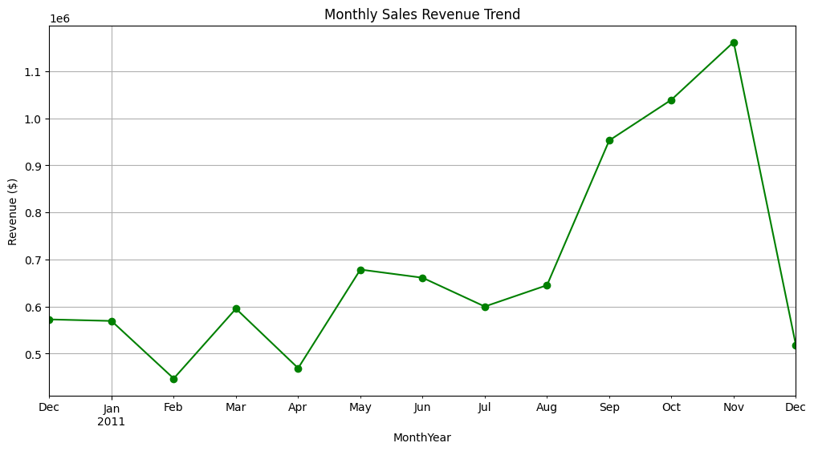

# E-commerce Sales Performance Analysis
An end-to-end data analysis project using Python to uncover business growth opportunities for a global retail brand.

## 📊 Project Overview
The goal of this project was to analyze over 500,000 rows of transaction data to identify:
* Which countries generate the most revenue.
* Monthly sales trends to help with inventory planning.
* High-value customer segments.

## 🛠️ Tools Used
* **Language:** Python
* **Libraries:** Pandas (Data Cleaning), Matplotlib (Visualization)
* **Environment:** Google Colab

## 📈 Key Business Insights
1. **The Holiday Spike:** Revenue peaks significantly in November, suggesting a heavy reliance on Q4 holiday shopping. 
   * *Recommendation:* Increase marketing spend in early October.
2. **Market Dominance:** While the UK is the largest market, other European markets show higher average transaction values.

## 🖼️ Visuals

